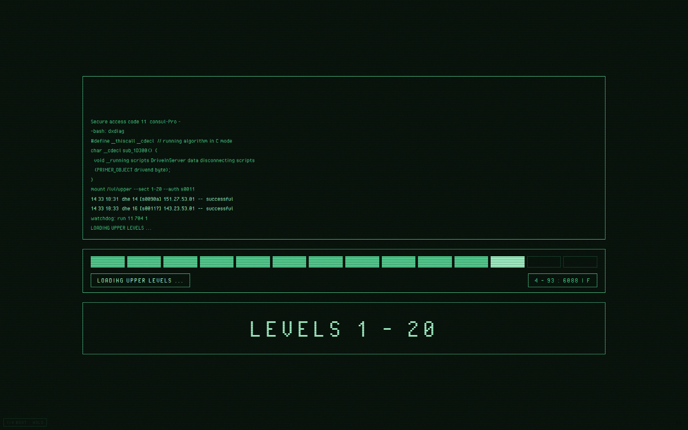
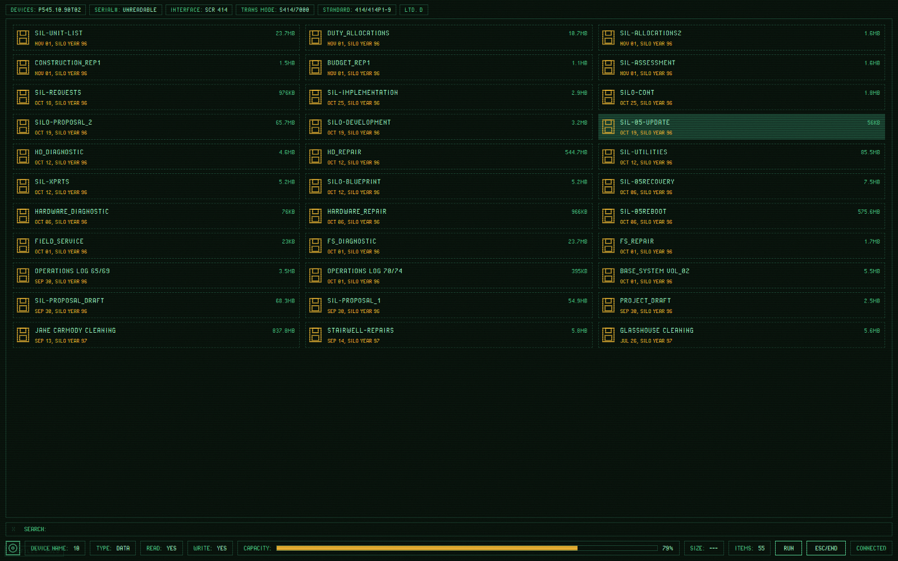
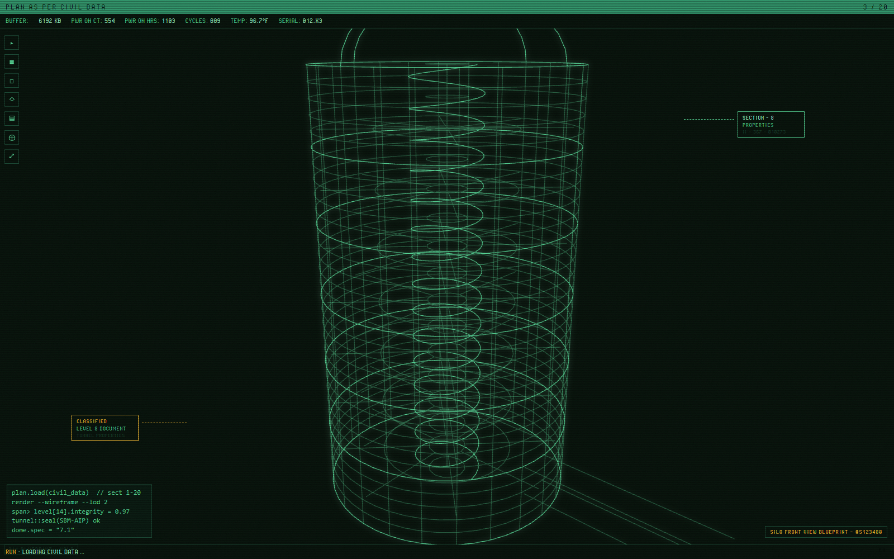
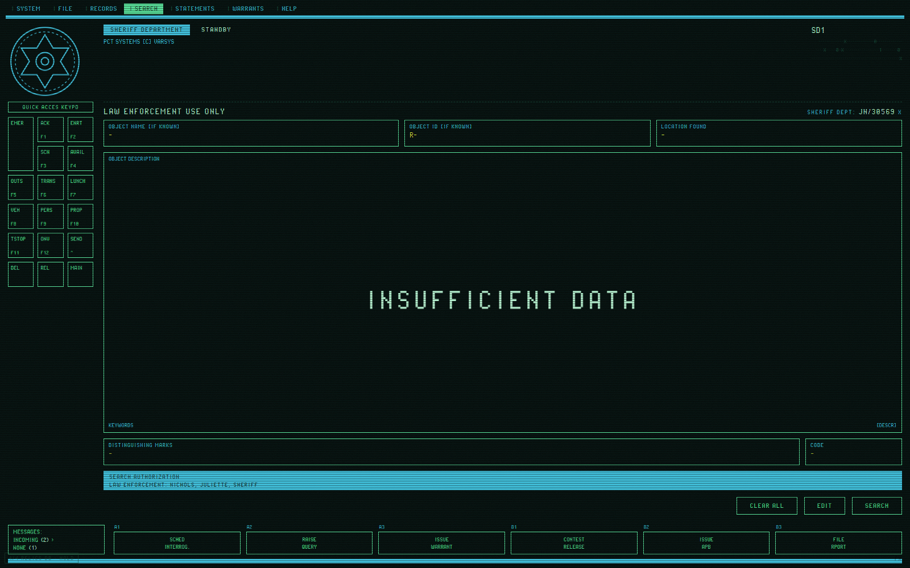
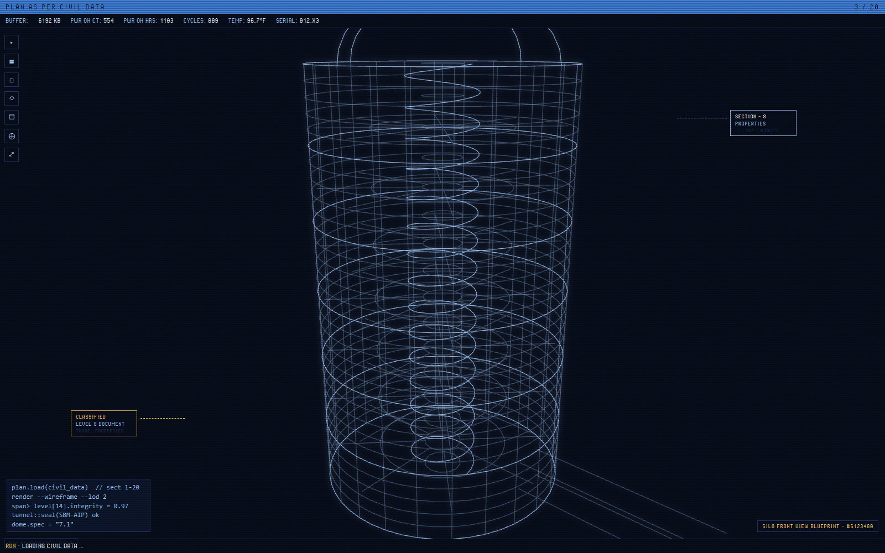

# SILO-OS

A faithful fan recreation of the computer interfaces from the **SILO** TV series
(Apple TV+), built as a living demo: an *attract loop* that cycles through iconic
screens on its own and also responds to the keyboard — much like the interactive
loops Territory Studio ran live on set. Vanilla HTML/CSS/JS + Three.js
(fully local, no build step, no internet at runtime).

> **Non-commercial fan project / homage.** Not affiliated with or endorsed by
> Apple TV+ or Hugh Howey. The code is MIT-licensed (see `LICENSE`); the world,
> names and visual designs of the show belong to their respective owners.
> Made by fans, for fans — and as an exercise in FUI (fictional user interfaces)
> inspired by the work of Territory Studio.

## Screens

The attract loop cycles through four screens; everything below is real output
of the demo (no mockups):

| | |
|:--:|:--:|
|  |  |
| **BOOT** — access log types itself, segmented loader, LEVELS 1-20 | **DISK UTILITIES** — CONNECT DEVICE → SCANNING → recovered file grid |
|  |  |
| **BLUEPRINT** — procedural 3D wireframe silo, rotating through 3 views | **RELICS DATABASE** — form types itself, searches… INSUFFICIENT DATA |



**VAULT tech** — the entire system re-skins to the modern vault blue with one
key (`T`); even the 3D wireframe color comes from the same design tokens.

## Running it

You need a local server (ES modules don't load over `file://`). With Python:

```bash
cd silo-os
python -m http.server 8000
```

Then open <http://localhost:8000> in your browser. Fullscreen: `F11`.

## Controls

| Key | Action |
|-----|--------|
| `1` `2` `3` `4` | Jump to BOOT / FILES / BLUEPRINT / RELICS |
| `SPACE` | Pause / resume the automatic cycle |
| `F` | Open / close the visual FX panel |
| `T` | Toggle tech: RETRO (phosphor) ↔ VAULT (vault blue) |

In the FX panel (`F`): every CRT effect (scanlines, phosphor glow, rolling
interference bar, flicker, grain, vignette) toggles individually, plus the TECH
switcher. Your settings persist across sessions (localStorage).

## URL parameters (dev / capture)

- `?app=boot|files|blueprint|relics` — start on that screen.
- `&hold` — freeze the cycle (no auto-advance).
- `&theme=retro|vault` — force the tech theme.

E.g. `index.html?app=blueprint&hold&theme=vault`

## Video

Watch the loop in action (with the synthesized bunker ambience):
**https://youtu.be/vx1xQYBYoE8**

## Structure

```
silo-os/
  index.html           entry point
  css/
    tokens.css         theme/department color tokens (RETRO/VAULT) ← single source of color
    crt.css            CRT effect layer + FX panel
    app.css            shared app chrome
    screens.css        per-screen styles
    fonts.css          local pixel fonts
  js/
    main.js            bootstrap
    fx.js              CRT effects + panel
    theme.js           RETRO/VAULT switcher
    shell.js           state machine / attract mode
    silo-model.js      procedural 3D silo model
    apps/              one screen per file
  vendor/three/        Three.js r185 (vendored)
  assets/fonts/        fonts (licenses included)
  font-test.html       typography lab
  probe.html           verification harness (not part of the product)
```

## Fidelity

The design was validated against a detailed inventory of 49+ reference frames
from the show (an internal "visual bible"), not against memory. Texts, names,
telemetry and file names come from that corpus — the keypad reads
`QUICK ACCES KEYPD` (sic) because that's what's on screen.

## Roadmap

Screens already inventoried from reference frames, coming in future releases:

- **SiloMail** — resident mail (`REPRODUCTIVE CLEARANCE GRANTED`) and the
  Sheriff's direct-message chat
- **PREGNANCY OPPORTUNITY TIME** — the countdown, glowing green counter and all
- **SEARCH RECORDS** — person files with dithered record photos
- **PACT COLLECTIVE SYSTEM** — SYSTEM PARTITIONING monitor, CPU staircase
  graphs, priority notifications
- **CRITICAL SUPPLY INVENTORY** — the Lotus-style spreadsheet
- **Judicial vault viewer & I.T. cipher decoder** — season-2 screens, kept
  spoiler-free (the decoder will actually decode, live)
- **Sound** — Web Audio CRT hum and mechanical keys inside the demo itself
